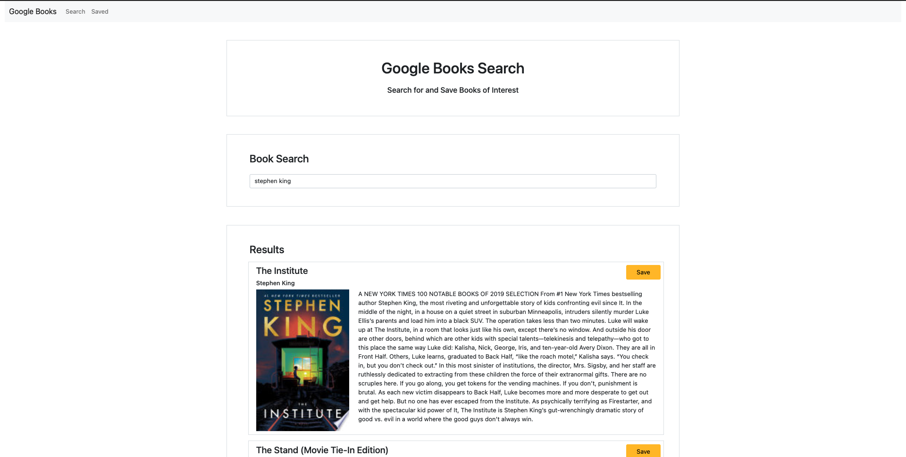
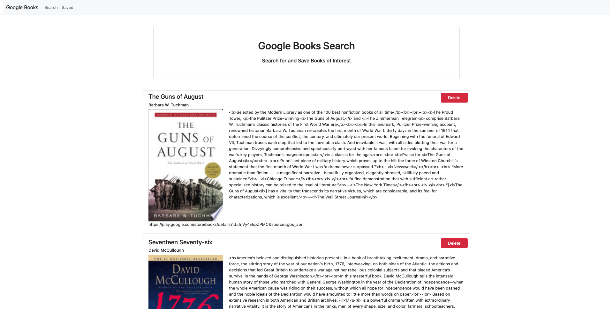

# Google Books

## Table of Contents
* [Project Summary](##project-summary)
* [Technologies Used](##technologies-used)
* [How to Access](##how-to-access)
* [About Me](##about-me)
* [Screenshots](##screenshots)
---

## Project Summary
This is as an app that searches Google Books, returns the results, and then saves books chosen by the user to a database.

## Technologies Used
* [JavaScript](https://developer.mozilla.org/en-US/docs/Web/JavaScript)
* [HTML5](https://developer.mozilla.org/en-US/docs/Web/Guide/HTML/HTML5)
* [CSS3](https://developer.mozilla.org/en-US/docs/Archive/CSS3)
* [React](https://reactjs.org/)
* [MongoDB](https://www.mongodb.com/)
* [Express](https://expressjs.com/)

## How to Access
[Website Link](https://immense-bayou-90700.herokuapp.com/)

## About Me
* [LinkedIn](www.linkedin.com/in/the-real-jordan-kelly)
* [GitHub](https://github.com/profjjk)

## Screenshots

